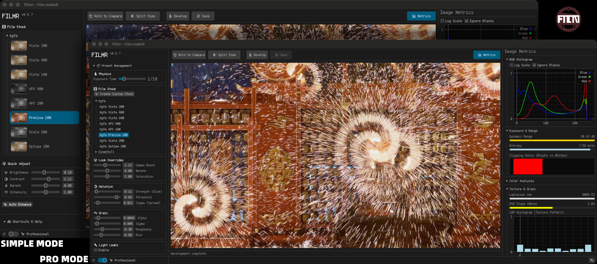

# Filmr

<p align="center">
  
</p>

<p align="center">
  <strong>FilmeR / Film Rust</strong>
</p>

<p align="center">
  <a href="https://crates.io/crates/filmr">
    
  </a>
  <a href="https://github.com/thetechgeekko/filmr/blob/main/LICENSE">
    
  </a>
  <a href="https://crates.io/crates/filmr">
    
  </a>
</p>

**Filmr** is a high-fidelity, physics-based film simulation engine written in Rust. Unlike simple LUT-based filters, Filmr simulates the physical properties of photographic film — from spectral light propagation through multi-layer emulsion stacks to chemical development curves, grain structure, halation, and optical aberrations — to produce output that matches the characteristic look of specific film stocks.



## 📖 Table of Contents

- [Core Features](#-core-features)
- [Quick Start](#-quick-start)
- [Installation](#-installation)
- [Architecture](#-architecture)
- [Simulation Modes](#-simulation-modes)
- [Supported Film Stocks](#-supported-film-stocks)
- [Android Integration](#-android-integration)
- [Testing](#-testing)
- [CI](#-ci)
- [License](#-license)

## 🚀 Core Features

- **🔬 Full-Spectrum Simulation** — Accurate mode propagates light through 81 wavelength bins (380–780 nm) using Beer-Lambert absorption and Fresnel reflections across a physical `FilmLayerStack`. Fast mode uses a pre-computed 3×3 spectral matrix for real-time performance.
- **🌾 Physics-Based Grain** — Selwyn model: σ(D) = √(α·D + σ_read²). Density-dependent, spatially correlated via blurred noise texture, applied in both density and output space.
- **📈 H-D Characteristic Curves** — Per-channel segmented curves (D-min, D-max, Gamma) with error-function or logistic sigmoid shapes for shoulder and toe rendering.
- **✨ Halation & Light Leaks** — Threshold masking → Gaussian blur → additive tint blend. Configurable shapes (circle, linear, organic fire, plasma interference).
- **⏱️ Reciprocity Failure** — Schwarzschild-effect exposure loss on long exposures (per-stock beta coefficient).
- **🎭 Interlayer Inhibition** — Development coupling between emulsion layers via configurable color matrix (dye cross-talk).
- **🔭 Optical Effects** — Depth-of-field with Petzval swirl, object-motion blur (depth-modulated), chromatic aberration, MTF softness, physiological camera tremor.
- **🎨 30+ Film Presets** — Kodak, Fujifilm, Ilford, Agfa, Polaroid, and specialty stocks across 5 style variants (Accurate, Artistic, Vintage, High Contrast, Pastel).
- **📊 Diagnostic Tools** — `FilmMetrics`: Lab color stats, LBP/GLCM texture analysis, PSD slope, entropy, clipping ratios.
- **⚡ High Performance** — `rayon` pixel-level parallelism; SIMD `f32x4` for spectrum math and Gaussian blur; optional WGPU GPU acceleration.

## ⚡ Quick Start

### Run the Desktop App

```bash
cargo run -p filmr_app --bin filmr_ui --release   # egui GUI — drag-drop, real-time preview
cargo run -p filmr_app --bin filmr_cli -- --help  # CLI batch processor
```

### Use as a Library

```toml
[dependencies]
filmr = { path = "../filmr" }
```

```rust
use filmr::{Processor, SimulationConfig};
use image::open;

let img = open("photo.jpg")?.into_rgb8();
let config = SimulationConfig::default(); // Portra 400, Fast mode
let result = Processor::new(config).process(&img)?;
result.save("output.jpg")?;
```

### Generate Diagnostic Charts

```bash
cargo run --example chart_diagnosis --release
# Output → diagnosis_output/contact_sheet.jpg
```

## 📦 Installation

### Install from Binary

#### macOS (Homebrew)
```bash
brew install W-Mai/cellar/filmr_app
```

#### Windows (PowerShell)
```powershell
irm https://github.com/W-Mai/filmr/releases/latest/download/filmr_app-installer.ps1 | iex
```

#### Linux / macOS (Shell)
```bash
curl --proto '=https' --tlsv1.2 -LsSf https://github.com/W-Mai/filmr/releases/latest/download/filmr_app-installer.sh | sh
```

### Build from Source

Requires Rust stable (1.70+).

```bash
git clone https://github.com/thetechgeekko/filmr.git
cd filmr
cargo build --release
cargo test
```

## 🏗 Architecture

Input is linearised from sRGB, passed through optional lens/motion stages (micro-motion, object motion, DOF, rotation, MTF, chromatic aberration), then developed via either a fast 3×3 spectral matrix (`SimulationMode::Fast`) or a full physical Beer-Lambert simulation (`SimulationMode::Accurate`). Grain, auto-levels, and gamma encoding are applied last. See [CLAUDE.md](CLAUDE.md) for the full pipeline diagram and module map.

## 🎛 Simulation Modes

### Fast Mode (`SimulationMode::Fast`)

A pre-computed 3×3 spectral matrix converts linear RGB to film-space exposure with a single matrix multiply per pixel. ~1–5 ms for a 12 MP image on a modern CPU. Suitable for real-time preview.

### Accurate Mode (`SimulationMode::Accurate`)

Each pixel is propagated through an 81-bin spectrum across a physical `FilmLayerStack` using Beer-Lambert absorption and Fresnel reflections (forward + backward pass through each emulsion layer). A binary-search normalisation step ensures consistent 18% gray response across all presets. ~20–50× slower than Fast mode but physically grounded.

### Feature Flags

| Flag | Effect |
|------|--------|
| *(none)* | Core CPU simulation, no JNI |
| `android` | JNI entry points + TIFF/DNG decode + safety bounds checks |
| `depth` | Depth Anything V2 monocular depth via rten backend |
| `gpu` / `compute-gpu` | WGPU shaders for linearisation, halation, MTF |
| `android,depth` | Full Android build with depth estimation |

## 🎞️ Supported Film Stocks

| Manufacturer | Stocks |
|-------------|--------|
| **Kodak Color** | Portra 160, Portra 400, Portra 800, Ektar 100, Gold 200 |
| **Kodak B&W** | Tri-X 400, T-Max 100/400, Plus-X 125 |
| **Kodak Slide** | Kodachrome 25, Kodachrome 64 |
| **Fujifilm Slide (E-6)** | Velvia 50, Velvia 100, Provia 100F, Astia 100F |
| **Fujifilm Negative (C-41)** | Superia 100, Superia 200, Superia 400 |
| **Fujifilm B&W** | Neopan 400, Neopan 100 Acros |
| **Ilford B&W** | HP5+, FP4+, Delta 100, Delta 400, Pan F+, SFX 200 |
| **Agfa** | Vista 200, Ultra 100 |
| **Polaroid** | SX-70 |
| **Specialty** | Lomochrome Purple |

Each preset ships with 5 style variants: **Accurate**, **Artistic**, **Vintage**, **High Contrast**, **Pastel**.

### Adding a Film Stock

1. Copy the nearest stock in `src/presets/` as a template
2. Set spectral params (R/G/B sensitivity peak wavelengths + widths), H-D curve parameters per channel, grain `alpha`, halation settings, and color matrix
3. Add it to the manufacturer's `get_stocks()` vec in `src/presets/` and to the `stock_by_key()` match arm in `src/android.rs`
4. `cargo test` — integration tests verify all registered presets produce finite, non-clipping output

## 📱 Android Integration

filmr and [unprocess](https://github.com/thetechgeekko/unprocess) must be **sibling directories**.

**Prerequisites**

```bash
rustup target add aarch64-linux-android armv7-linux-androideabi \
                  x86_64-linux-android i686-linux-android
cargo install cargo-ndk
# Android NDK r25c+; set ANDROID_NDK_ROOT
```

**Cross-compile**

```bash
# Film simulation only (~4 MB per ABI)
cd android && ./build-android.sh

# With Depth Anything V2 (~20 MB per ABI)
cd android && ./build-android.sh --with-depth
```

The script copies `libfilmr.so` for all four ABIs into `../unprocess/app/src/main/jniLibs/`.

**JNI entry points** (`src/android.rs`):

| Function | Description |
|----------|-------------|
| `processImage` | RGBA bitmap → film simulation |
| `processImageWithDepth` | RGBA bitmap + depth model → film + DOF/motion |
| `processRawDng` | DNG bytes → Bayer demosaic + film simulation |
| `isDepthSupported` | Returns whether compiled with `depth` feature |
| `getAvailablePresets` | JSON list of registered presets |
| `getDefaultConfig` | JSON default `SimulationConfig` |

All JNI functions validate input array lengths (≤ 256 MB) and DNG dimensions (≤ 16 384 × 16 384) before any allocation. JSON config parse errors propagate as `RuntimeException` rather than silently defaulting.

## 🧪 Testing

```bash
cargo test -p filmr --no-default-features   # fast core tests (CI gate)
cargo test                                   # full workspace including GPU tests
cargo test verify_grain                      # grain synthesis tests
cargo test accurate_integration              # full pipeline round-trips
cargo test chemical_stress                   # extreme parameter ranges
```

## ⚙️ CI

| Workflow | Checks |
|----------|--------|
| `ci.yml` | `cargo check --features android`, `cargo check --features android,depth`, `cargo test`, `cargo audit`, Android cross-compile (arm64-v8a, NDK r25c) |
| `rust.yml` | `cargo fmt --check`, `cargo build --all-features`, `cargo clippy -D warnings`, security audit |

## 📄 License

This project is open source and available under the **MIT License**.
